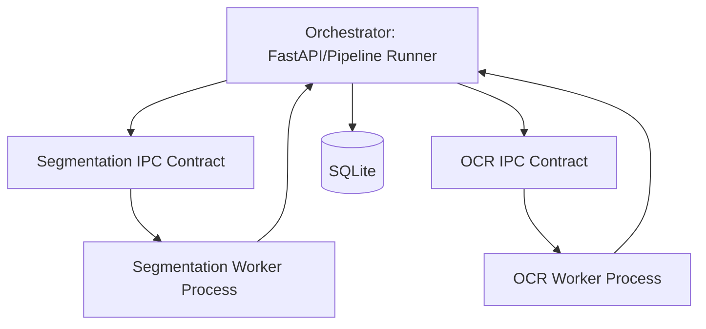

# OCR Process Split

This section documents the intended split of segmentation and OCR engines into
isolated worker processes.

## Target topology

## Design constraints

- Worker payloads must be versioned and backward compatible during migration.
- Timeout and cancellation semantics must be explicit per job phase.
- Failed worker calls must map to deterministic job status transitions.
- Page ordering must remain stable across parallel worker completion.

## Regression risks

- Silent contract drift between orchestrator and workers.
- Partial writes after worker failure.
- Runtime-gate release leaks when worker startup fails.
