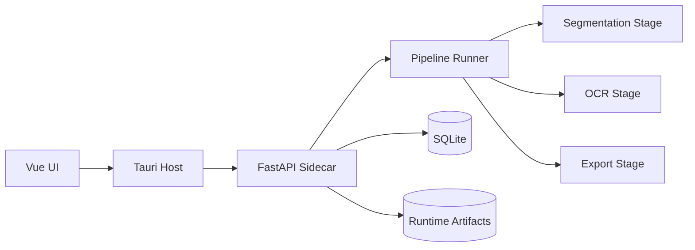

# System Overview

## Notes

- The sidecar backend is the runtime coordinator.
- Pipeline state is tracked through OCR jobs and runtime gate constraints.
- Persistence is database-backed for project/page/line state.
