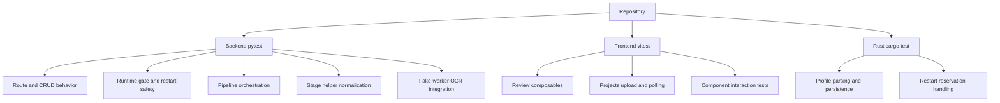
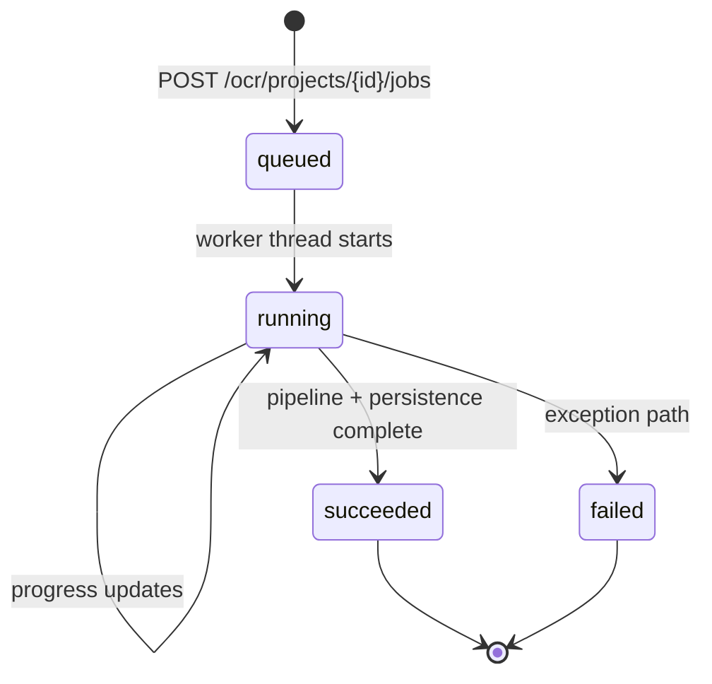
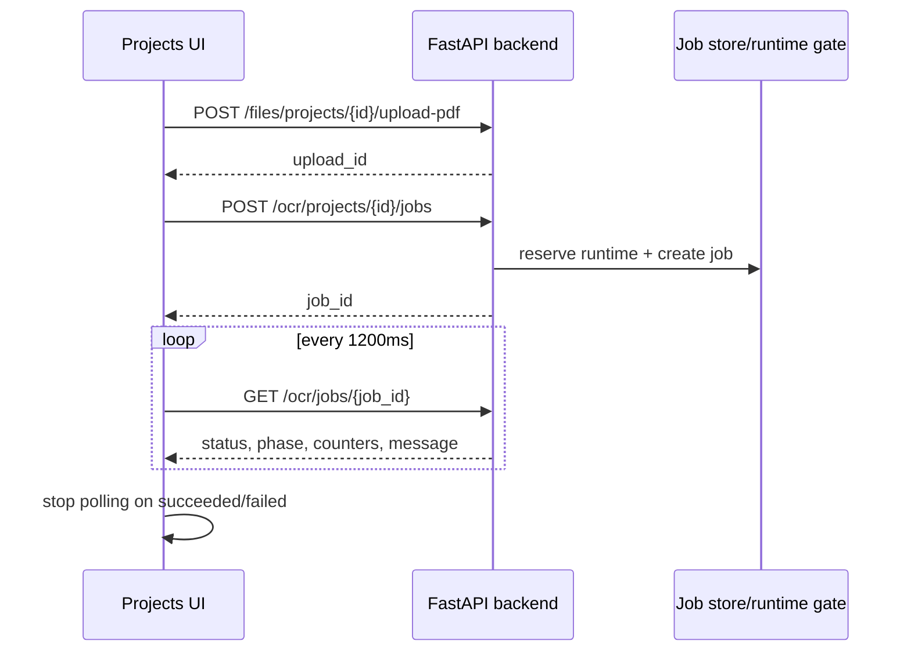

# Testing Architecture (Generated)

Generated: 2026-10-01

This document summarizes how tests are organized across backend, frontend, and
Tauri components, and how OCR runtime orchestration is validated without model
weights.

## Suite Topology

## OCR Job Lifecycle (Backend)

## Frontend Upload and Polling Flow

## Coverage Priorities for Process Split

1. Keep OCR route lifecycle tests as strict contract tests for process
   reservation, job state transitions, and transcript retrieval.
2. Keep runner failure-ordering tests to guarantee deterministic page ordering
   despite multi-process segmentation.
3. Keep helper normalization tests to protect serialization/compatibility
   assumptions at process boundaries.
4. Keep fake-worker integration tests to validate persistence behavior without
   loading heavy ML runtimes.
5. Keep frontend polling/upload tests to lock client behavior for queued,
   running, failed, and recovered jobs.
